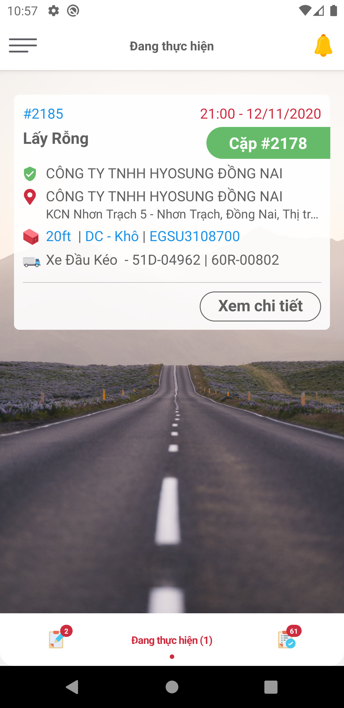

### **ĐĂNG NHẬP**
### **1. Đăng nhập vào ứng dụng**

Tài xế tải và cài đặt ứng dụng Kasper trên CH Play vào điện thoại, đăng nhập vào ứng dụng bằng tài khoản được cấp.

- Màn hình đăng nhập:

  

- Các bước thực hiện:
  - (1): Nhập số điện thoại đã đăng ký
  - (2): Nhập mật khẩu
  - (3): Bấm nút Đăng nhập

            

### **2. Quên mật khẩu Mobile App**

- Bấm Quên mật khẩu ở giao diện màn hình đăng nhập

  

  - (1): Nhập số điện thoại đã đăng ký
  - (2): Bấm nút Tiếp tục

- Hệ thống tự động gửi mã xác nhận về số điện thoại vừa nhập

  

  - (1): Nhập mã xác nhận
  - (2): Bấm nút Xác thực
  - (3): Nhập mật khẩu mới
  - (4): Nhập lại mật khẩi mới
  - (5): Bấm nút Đặt lại mật khẩu
  
- Đặt lại mật khẩu thành công, tài xế đăng nhập vào ứng dựng bằng mật khẩu mới.

                  

### **THỰC HIỆN CÔNG VIỆC**
> Sau khi Điều phối phân công công việc, lệnh thực hiện công việc được gửi đến ứng dụng của tài xế. Tài xế tiến hành thực hiện công việc theo quy trình sau:

### **1. Đăng nhập vào ứng dụng**

- Màn hình đăng nhập:

  

- Các bước thực hiện:
  - (1): Nhập số điện thoại đã đăng ký
  - (2): Nhập mật khẩu
  - (3): Bấm nút Đăng nhập

### **2. Nhận công việc được phân công**

- Màn hình nhận công việc được phân công:

  

- Các bước thực hiện:
  - (1): Nhấn nút Thực hiện
  - (2): Bấm xác nhận (Công việc chuyển sang trạng thái Đang thực hiện)

### **3. Thực hiện công việc**

- Màn hình thực hiện công việc:

  

  - (1): Thông tin của công việc
  - (2): Bản đồ tuyết đường tối ưu để thực hiện công việc
  - (3): Nút gọi đến người liên hệ
  - (4): Các chứng từ bắt buộc phải cung cấp
  - (5): Nút tải hình ảnh chứng từ
  - (6): Trạng thái công việc

- Các bước thực hiện:

  

  - (1): Sau khi thực hiện công việc, tải các hình ảnh chứng từ lên hệ thống
  - (2): Bấm Hoàn thành
  - (3): Công việc vừa thực hiện chuyển sang trạng thái Hoàn thành

                

### **THỰC HIỆN CẶP CỔ CONT**
### **1. Màn hình danh sách công việc**

- Hai công việc thực hiện đồng thời được xếp gần nhau như sau:

    

### **2. Thực hiện**

- 2.1. Trong màn hình ở trên tài xế chọn thực hiện công việc đầu tiên.

    

- 2.2. Tài xế thực hiện hoàn thành công việc đầu tiên.

    

- 2.3. Sau khi hoàn thành công việc đầu tiên, công việc đồng thời còn lại vẫn nằm ở phần công việc **đang thực hiện**

    

- 2.4. Tài xế tiếp tục hoàn thành công việc đồng thời còn lại

    

- 2.5. Tài xế tiếp tục thực hiện các công việc đã được phân công khác trong danh sách công việc

    

        

### **CÁC CHỨC NĂNG KHÁC**

### **1. Xem vị trí hiện tại**

- Màn hình hiển thị:

  

- Các bước thực hiện:

  - Đăng nhập vào hệ thống
  - Ở thanh chức năng thông tin của tài xế, bấm Tín hiệu GPS

- Màn hình kết quả:

  

  - (1): Hệ thống tự động chuyển sang giao diện Tín hiệu GPS
  - (2): Vị trí hiện tại của tài xế
  - (3): Nhấn nút quay lại để tắt chức năng

### **2. Đổi mật khẩu**

- Màn hình hiển thị:

  

- Các bước thực hiện:

  - Đăng nhập vào hệ thống
  - Ở thanh chức năng thông tin của tài xế, bấm Đổi mật khẩu

- Màn hình kết quả:

  

  - (1): Hệ thống tự động chuyển sang giao diện Đổi mật khẩu
  - (2): Nhập mật khẩu cũ
  - (3): Nhập mật khẩu mới
  - (4): Nhập lại mật khẩu mới
  - (5): Bấm Đổi mật khẩu
  - (6): Nhấn nút quay lại để tắt chức năng